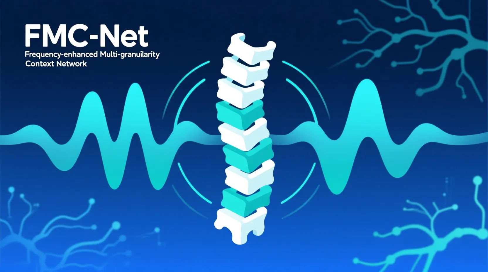
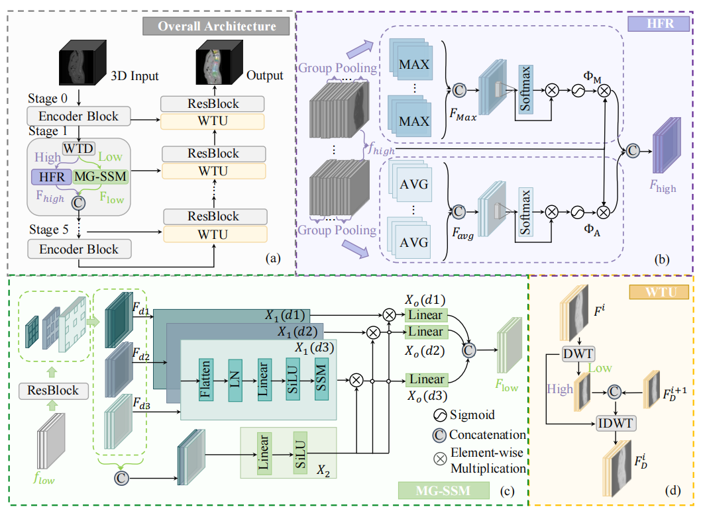
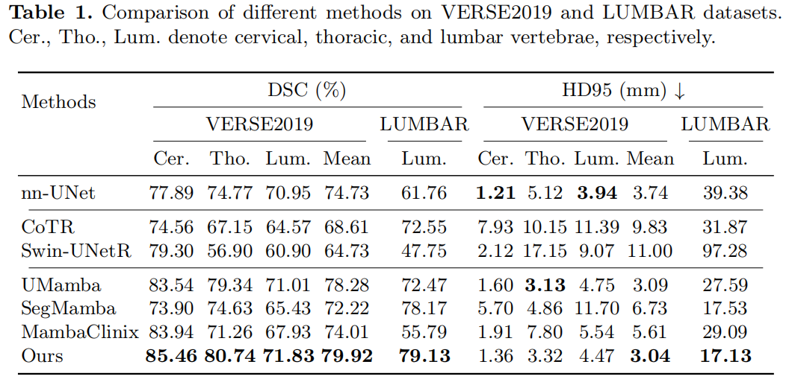
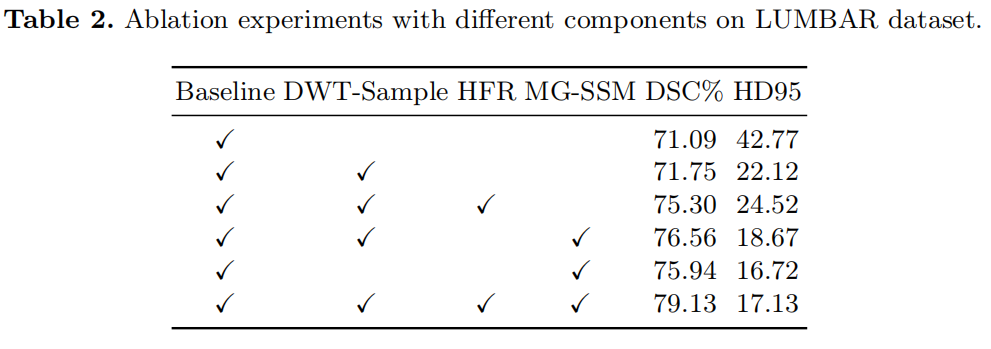
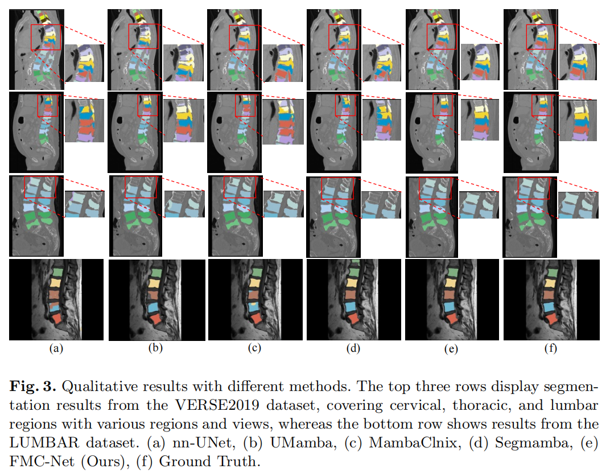

  <h1 align="center">Frequency-enhanced Multi-granularity Context
Network for Efficient Vertebrae Segmentation</h1>


  <p align="center">
    
  <p align="center">


  <p align="center">
    <a href="https://github.com/goupup-ai/miccai25" rel="external nofollow noopener" target="_blank"><strong>Jian Shi</strong></a>
    ·
    <a href="https://github.com/goupup-ai/miccai25" rel="external nofollow noopener" target="_blank"><strong>Tianqi You</strong></a>
    ·
    <a href="https://scholar.google.com/citations?user=MfbIbuEAAAAJ&hl=zh-CN" rel="external nofollow noopener" target="_blank"><strong>Pingping Zhang*</strong></a>
    ·
    <a href="https://scholar.google.com/citations?user=rgtOrCMAAAAJ&hl=zh-CN&oi=sra" rel="external nofollow noopener" target="_blank"><strong>Rui Xu</strong></a>
  </p>
<p align="center">
    <a href="https://arxiv.org/pdf/2506.23086" rel="external nofollow noopener" target="_blank">MICCAI 2025 Paper</a>
  <p align="center">
    
  <p align="center">
<p align="center" style="font-size: 18px; color: gray;">
    Figure 1: Challenging examples in vertebrae segmentation.
</p>
<p align="center">
    
</p>
<p align="center" style="font-size: 18px; color: gray;">
    Figure 2: Overall Framework of FMC-Net.
</p>


 **FMC-Net** is a novel vertebrae segmentation framework. Specifically, we first apply wavelet transform for lossless downsampling to reduce the feature distortion in blurred images. The decomposed high and low-frequency components are then processed separately. For the high-frequency components, we apply a High-frequency Feature Refinement (HFR) to amplify the prominence of key features and filter out noises, restoring fine-grained details in blurred images. For the low frequency components, we use a Multi-granularity State Space Model (MG-SSM) to aggregate feature representations with different receptive fields, extracting spatially-varying contexts while capturing long-range dependencies with linear complexity. The utilization of multi-granularity contexts is essential for distinguishing similar vertebrae and improving segmentation accuracy. Extensive experiments demonstrate that our method outperforms state-of-the-art approaches on both CT and MRI vertebrae segmentation datasets.

---

## News 📢

- We released the **FMC-Net** codebase and paper! [Paper](https://arxiv.org/pdf/2506.23086)
- Great news! Our paper has been accepted to **MICCAI 2025**! 🏆

---

## Table of Contents 📑

- [Introduction](#introduction)
- [Contributions](#contributions)
- [Experimental Results](#experimental-results)
- [Visualizations](#visualizations)
- [Reproduction](#reproduction)
- [Citation](#citation)

---

## **Introduction** 🌟

Automated and accurate segmentation of individual vertebra in 3D CT and MRI images is essential for various clinical applications. Due to the limitations of current imaging techniques and the complexity of spinal structures, existing methods still struggle with reducing the impact of image blurring and distinguishing similar vertebrae.

To alleviate these issues, we introduce a Frequency-enhanced Multi-granularity Context Network (FMC-Net) to improve the accuracy of vertebrae segmentation.

---

## **Contributions** 

**1.**We propose FMC-Net that leverages wavelet transform to avoid information loss and enhances high and low-frequency features to address the challenges of image blurring and the high similarity of vertebral structures.

**2.**For the high-frequency components, we introduce the HFR to restore fine grained details. For the low-frequency components, we employ the MG-SSM to capture spatially-varying long-range dependencies.

**3.** Experiments on VERSE2019 and LUMBAR datasets demonstrate the superior performance of FMC-Net compared to other state-of-the-art approaches.

## **Results**

### Segmentation[VERSE2019, LUMBAR]

<p align="center">
    
</p>

---
### Ablation Studies [LUMBAR]

<p align="center">
    
</p>

---
## **Visualizations**

### Qualitative results with different methods

<p align="center">
    
</p>
---

## **Reproduction**

### Datasets

- **VERSE2019**: [Google Drive](https://drive.google.com/drive/folders/1EscBadX-wMAT56_It5lXY-S3-b5nK1wH)  
- **Lumbar**: [Baidu Pan](https://pan.baidu.com/s/1xqqh7N4Lctm3RcUdskG0Ug) 

---

### Training

```bash
conda create -n UMverse python=3.10
conda activate UMverse
pip install torch==2.0.1 torchvision==0.15.2 torchaudio==2.0.2
cd (your_path)
pip install -r requirements.txt
cd (your_path/umamba)
pip install -e .
nnUNetv2_plan_and_preprocess -d DATASET_ID --verify_dataset_integrity
nnUNetv2_train DATASET_ID 3d_fullres 0 -tr nnUNetTrainerUM
```

---

## **Citation**

If you find **FMC-Net** helpful in your research, please consider citing:

```bibtex
@article{shi2025frequency,
  title={Frequency-enhanced Multi-granularity Context Network for Efficient Vertebrae Segmentation},
  author={Shi, Jian and You, Tianqi and Zhang, Pingping and Zhang, Hongli and Xu, Rui and Li, Haojie},
  journal={arXiv preprint arXiv:2506.23086},
  year={2025}
}
```
